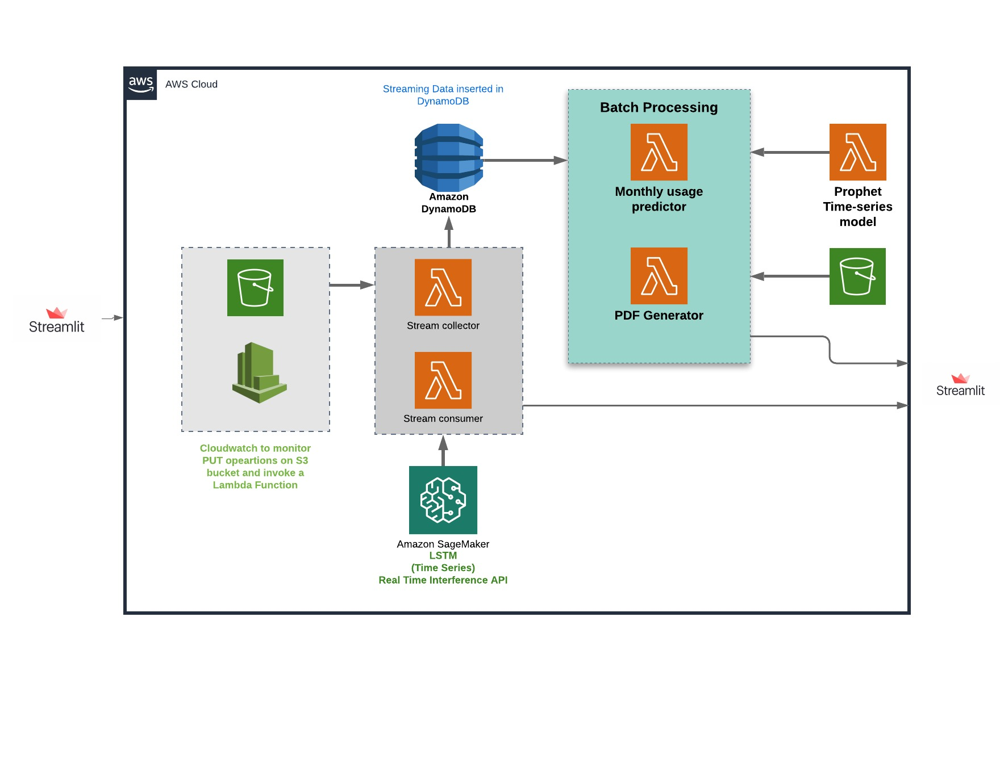

  [](https://www.python.org/)

# CSYE7245 Real-time Streaming Data Analysis for Household Energy Consumption

This repository contains a serverless architecture for streaming data analysis that is robust and can be scaled to incoroprate a multitude of users by using concurrency in lambda functions. This project uses the AWS architecture, mainly - Amazon Kinesis, Amazon SageMaker and AWS Lambda functions.

**Team 1 - Members:**<br />
Pramod P Pai <br />
Prajwal S Mylar <br />
Shrivallabha Kulkarni <br />

##### Streamlit Application<br />
[](http://shields.io/)

Quick access to the frontend web application built using Streamlit: 


## Architecture Diagram


### Codelab document
https://codelabs-preview.appspot.com/?file_id=1QweinXID7XM22HwfUxpUpqQj_xby4-Eq1p3Wejzg2cA#4

## Steps to Reproduce Architecture
### Lambda Functions
All the Lambda functions shown in the architecture diagram have been deployed using SAM (Serverless Application model). Every Lambda function comes with it's own 
* template.yml
* requirements.txt
* main.py

Create an S3 bucket that will store the Lambda function's metadata for deployment
* aws s3api create-bucket \
--<your_bucket> \
--region <pass_region> \
--create-bucket-configuration LocationConstraint=<pass_region>


These files can be found in the folders in this repo with the prefix **'lambda_'**. Go into the respective folder and follow these steps to deploy your Lambda function on AWS:
* sam validate 
> returns a success message if the template is valid
* sam build --use-container --debug
>Builds the entire package into an AWS like docker environment
* sam package --s3-bucket <your_bucket> --output-template-file out.yml --region <pass_region>
>Add the bucket name that you previously created along with the desired region
* sam deploy --template-file out.yml --stack-name <stack_name> --region <pass_region> --no-fail-on-empty-changeset --capabilities CAPABILITY_IAM  
> Enter a name for the stack, recommended name is the same as the **lambda_** folder names   

Go to AWS CloudFormation to check if your stack has been created.

### [Amazon Kinesis Streams](https://aws.amazon.com/kinesis/)

The following code was used to create the Kinesis stream used in this architecture. It is important to create the stream before running the pipeline.
```
client.create_stream(StreamName="stream-name", ShardCount=1)
```
### Other Resources
The template files create the following resources apart from the Lambda functions to support the workflow of the architecture. All the details about these resources are in the template files in the respective folders
* S3 Bucket 1
* S3 Bucket 2
* DynamoDB Table
* CloudWatch

### Deploying the Streamlit App 

[Streamlit](https://www.streamlit.io/) is used to show the end-users how the deployed lambda functions come together for the three main features of the project i.e. stream-processing and batch-processing. The app directly interacts with the built components on AWS and provides a userinterface to run the pipeline.

The Python code for this app can be found at `streamlit_webapp/app.py`. This app is deployed on the EC2 Instance.

> Install required libraries

```
pip3 install streamlit
pip3 install boto3
pip3 install pandas
pip3 install configparser
```

> Run `app.py`

Run the WebApp by running `streamlit run app.py`. 

Modelling:

For forecasting, we have taken a Multivariate Times Series forecasting approach to predict future usage of power by an individual household. For this, we utilized an LSTM to train on our dataset. 
After multiple training sessions, we have saved our model checkpoints on S3.

Model Deployment:
For real time inference, we have chosen Amazon Sagemaker to provide predictions on  real-time streaming data. Sagemaker offers an intriguing feature are allowing users to host multiple models on the same end point. 

In order to deploy our saved model, we are required to stored our models in compressed .tar.gz format.

The untarred model directory structure may look like this.
   >model1
   >     |--[model_version_number]
   >         |--variables
   >         |--saved_model.pb
   > model2
   >     |--[model_version_number]
   >         |--assets
   >         |--variables
   >         |--saved_model.pb

Creating a SageMaker Model
A SageMaker Model contains references to a model.tar.gz file in S3 containing serialized model data, and a Docker image used to serve predictions with that model.
You must package the contents in a model directory (including models, inference.py and external modules) in .tar.gz format in a file named "model.tar.gz" and upload it to S3. If you're on a Unix-based operating system, you can create a "model.tar.gz" using the tar utility:
```
tar -czvf model.tar.gz model
```

After uploading your model.tar.gz to an S3 URI, such as s3://your-bucket/your-models/model.tar.gz, create a SageMaker Model which will be used to generate inferences.
Creating an Endpoint
A SageMaker Endpoint hosts your TensorFlow Serving model for real-time inference. The InvokeEndpoint API is used to send data for predictions to your TensorFlow Serving model.

Using Python SDK:
```
predictor = tensorflow_serving_model.deploy(initial_instance_count=1,
                                            framework_version='1.12',
                                            instance_type='ml.p2.xlarge')
prediction = predictor.predict(data)

```
Using boto3 to invoke endpoint:

```
import boto3

client = boto3.client('sagemaker-runtime')
custom_attributes = "c000b4f9-df62-4c85-a0bf-7c525f9104a4"  # An example of a trace ID.
endpoint_name = "..."                                       # Your endpoint name.
content_type = "..."                                        # The MIME type of the input data in the request body.
accept = "..."                                              # The desired MIME type of the inference in the response.
payload = "..."                                             # Payload for inference.
response = client.invoke_endpoint(
    EndpointName=endpoint_name, 
    CustomAttributes=custom_attributes, 
    ContentType=content_type,
    Accept=accept,
    Body=payload
    )

print(response['CustomAttributes']) 
```


Deploying to Multi-Model Endpoint
Multi-Model Endpoint can be used together with Pre/Post-Processing. Each model will need its own inference.py otherwise default handlers will be used. An example of the directory structure of Multi-Model Endpoint and Pre/Post-Processing would look like this:
>   /opt/ml/models/model1/model
        |--[model_version_number]
            |--variables
            |--saved_model.pb
    /opt/ml/models/model2/model
        |--[model_version_number]
            |--assets
            |--variables
            |--saved_model.pb


Feature 2: Monthly forecasting using Prophet

Considering real time streaming power usage data and the latest date we have collected the data for, we can forecast customers usage of power for the rest of the month. This can provide the customers with a lot of insight on whether to cut down on excessive usage of power.

Prophet uses Univariate Time Series forecasting and is trained on the entire dataset.
The checkpoint of the prophet model is saved in S3 storage.
```
m = Prophet()
m.fit(df)
```
The model is deployed for inference in such a way that given we have collected data till a certain time of the month, the model predicts the usage of power for the rest of the month.
We get this by feeding in a dataframe containing dates generated till the end of the month.
```
forecast = m.predict(dates_df)
```
Prophet also plots trends of usage, weekly, daily and yearly seasonality in the usage


